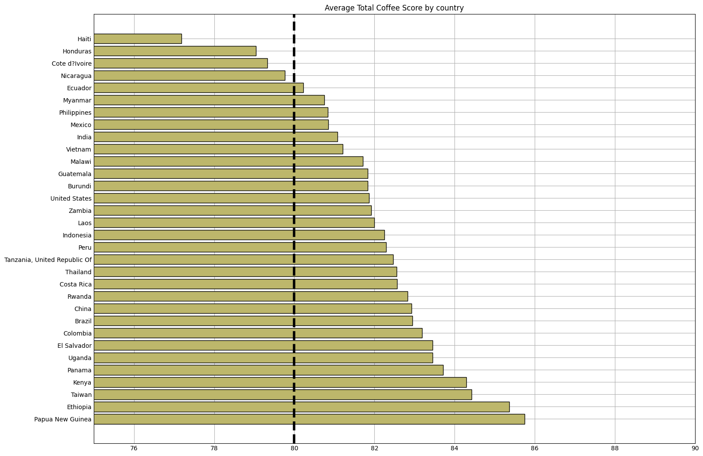
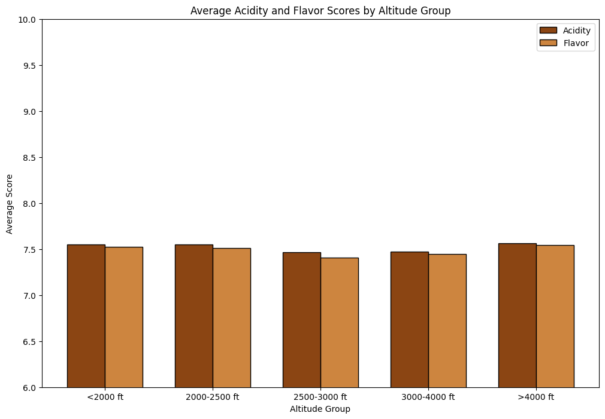
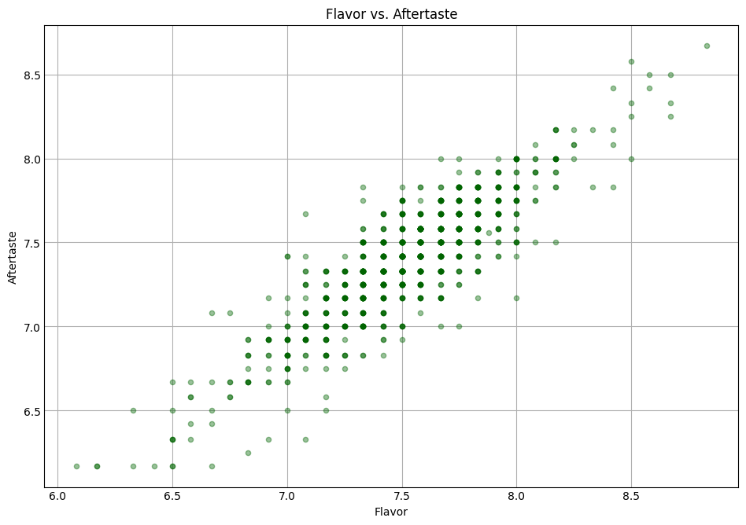

# **Brewing Data**

## Finding you the best coffee bean

College has been a life changing experience, but has also added a lot of stress to my life. From the early morning rugby games, to late night study sessions it is often hard to find the energy to keep going. Fortunately college brought to me the world of coffee. Now I am by no means a coffee expert, but I will become one today. Through research into the coffee making process, from where the beans are grown to how they are processed. Join me as I put on my coffee snob glasses, and guide you to finding the perfect coffee bean.

In order to navigate the ratings off these coffee beans effectively I will establish the benchmark I am using. The _coffee cupping score_ was developed by the [Specialty Coffee Association](https://sca.coffee) who created a 0-100 scale to rate coffee beans. They created the "specialty coffee" badge of honor. Which is awarded to any coffee bean that achieves a socre of 80 points or higher, and declares a bean commercial-grade if it falls below.

### Best country to source your coffee bean

I have denoted the _specialty coffee_ threshold to indicate which countries coffee beans are high-grade vs commercial-grade. As you can see from the visual we are predominantly dealing with specialty grade coffees, making it necessary to zoom in on scores and see where the best of the best separate.

Most of the results make perfect sense. We can see a country like Ethiopia coming in second. Ethiopia are renowned for their premier coffee culture, giving birth to the popular Arabica coffee. The United States and Kenya also rank in the top percentiles primarilty known for their Hawaiian Kona beans. All these regions meet the specialty-grade threshold.

These rankings should be taking lightly. They paint a good picture but do not give us a true ranking, due to the inconsistencies in beans for each country. Some countries like the heavyweights in the coffee bean industry (Brazil, Colombia, Guatemala, and Mexico), have hundreds of beans in the dataset but the top ranked country, Papa New Guinea had only one rated bean, compared to Columbia's 128. If you look at average scores for these heavyweight countries they sit slightly lower than the statistical top performers. This isn't because their coffee is worse but because they have massive sample sizes. When a country produces hundreds of different specialty beans, their average will naturally level out. These countries are the heavyweights for a reason and are the backbone of the global specialty coffee industry.

While this graph tell us geographically who is the best of the best, a high country doesn't not garuntee the best bean. There are many more factors to account for. The country of origin gets the bean started, but as we look closely at the data, we realize that where the bean is grown within that country, specifically how high up in the mountains, might be the real secret to a perfect cup.

### The Altittude Authority

To move away from the large geographical outlook off coffee beans, I want to zoom in and look at specific farms, and see the effect altitude has on bean growth. According to Nik Stopsack in his [coffee guide](https://www.stokedroasters.com/blogs/news/coffee-guide-altitudes-affect-on-beans?srsltid=AfmBOopQ2AWq_wmvzA1HyfgORmxws2qFYV_cSuG8J_WBAOELAZBghEYT) beans grown at higher altitudes tend to be higher quality with more complex flavor notes, than beans grown at lower altitudes. This is due to water and temperature. At higher altitudes cooler temperatures slow the growth of coffee plants, casuing the plant to focus more on reproduction. When the plant focuses more energy to bean production it produces more sugars which gives higher quality flavors to the bean. Higher altitudes also have better drainage from rain, which means the coffee plants take in less water which means the beans flavor is concentrated in the sugars. One particular flavor note that increases with altitude is acidity. Anywhere above 4,500ft a bean tends to be more acidic.

Accodring to the visulization above you can see that higher altitude still remains supreme. Posting a higher average flavor and acidity score than any other altitude group. However it is very close. At the end of the day it all comes down to your preference. If you prefer a less acidic coffee, pick a lower altitude bean, as you can see by the visul you won't be sacrificing a huge amount of flavor.

> **Interesting Fact:** Coffee bean packaging labels the altitude the bean was grown at. It is typicall denoted as MASL (Meters above sea level).

### The Flavor and Aftertaste Dynamic

